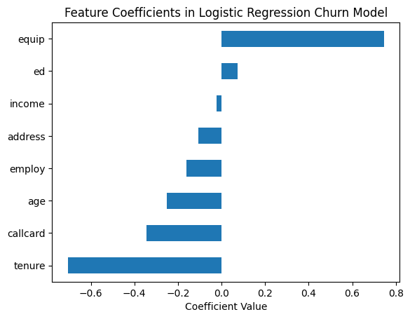

# Course 1: Machine Learning with Python

This folder contains coursework and projects completed for the **[Machine Learning with Python](https://www.coursera.org/learn/machine-learning-with-python?specialization=ai-engineer)** course, part of the [IBM AI Engineer Professional Certificate](https://www.coursera.org/professional-certificates/ai-engineer) on Coursera.

## 🧠 Course Description

This course introduces the foundations of machine learning using Python, covering both supervised and unsupervised learning techniques. Learners explore algorithms such as regression, classification, clustering, and recommender systems while applying them using real-world data and libraries like Scikit-learn.

By the end of this course, you will be able to:

- Understand and implement supervised learning models, including linear and logistic regression, decision trees, support vector machines (SVM), K-nearest neighbors (KNN), random forests, and XGBoost, applying them to real-world problems such as fraud detection, medical prescription, and customer churn.
- Apply unsupervised learning techniques including K-means, DBSCAN, HDBSCAN, PCA, t-SNE, and UMAP for tasks such as customer segmentation, gallery clustering, and high-dimensional data visualization.
- Evaluate model performance using metrics such as ROC-AUC, accuracy, confusion matrices, and clustering evaluation techniques including Voronoi diagrams and silhouette scores.
- Apply regularization techniques (Ridge and LASSO) for regression and feature selection, and build end-to-end machine learning pipelines with hyperparameter tuning using GridSearchCV.
- Build basic recommender systems and classification models for complex datasets, including Titanic survival prediction and rainfall forecasting, leveraging real-world data and competitive benchmarks.
-Use Python libraries like Pandas, Scikit-learn, Matplotlib, and Seaborn to process data, build, and evaluate machine learning models effectively and reproducibly.

---

## 📂 Contents: The coding projects I worked on (20 projects).

- `simple_linear_regression.py`: Using simple Linear Regression to predict co2 omission for a car (part 1). Best R-squared 0.68.
- `mulitple-linear-regression`: Predicting co2 omission for car using several features simulateneously (part 2). Best R-Squared 0.89. 
- `logistic_regression`: Predicting churn of customers in telecommunications company. 
- `multi_class_classification.py`: Multi-Class Classification: building the OvsAll, OvsO and mulinomial logistic regressions for obesitas level prediction.
- `decision_trees.py`: Building a decision tree for prescribing the correct medical drug.
- `regression_trees_taxi_tip.py`: Predicting the taxi tip. 
- `decision_tree_svm_ccfraud.py`: For the Kaggle Data set 'Credit Card Fraud Detection' with Decision Trees and SVM using python APIs, utilising hinge loss, obtained a SVM ROC-AUC score: 0.986.
- `knn_classification.py`: KNN for predicting service category telecommunications customers.
- `random__forests__xgboost.py`: Utilising Random Forest and XGBoost to predict housing prices. Evaluating both algorithms accuracy and speed.
- `k-means-customer-seg.py`: Applying K-means for customer segmentation on simulated data simulated and on a real dataset, evaluating results using a colour map.
- `comparing_dbscan_hdbscan.py`: Comparing DBSCAN to HDBSCAN on clustering art gallaries and musea (WGS84 date, and Web marcator (EPSG:3857)).
- `pca.py`: (a) projecting 2D data onto prinicpal axis via PCA and (b) exploring 4 dimensional reduction for iris flowers.
- `t-sne_umap.py`:Comparing t-SNE and UMAP, also against PCA, on feature space dimensions (on a synthetic make_blobs dataset)
- `evaluating_classification_models.py`: Evaluating classification models, models for predicting tumor being benign or malignant in breast cancer data set, adding gaussian noise for measurement error.
- `evaluating_random_forest.py`: Implementing a random forest to predict median housing price based on various attributes, evaluating its peformance and feature importance.
- `evaluating_k_means_clustering.py`: Generating synthetic data, creating k-means models, evaluate their perforamnce, investigate evaluation metrics for interpreting results (intution for the subjective practice of evaluating clustering results), Voronoi diagram.
- `regularization_in_linearregression.py`: Implementing regularization techniques such as RIDGE, evaluating their impact when there are outliers, select features using LASSO.
- `ml_pipelines_and_gridsearchcv.py`: Building and evaluating a ML pipeline, building a grid-search implementation, implementing and evaluating a classification using real-world data, extract feature importance.
- `practice_project`: Predicting whether a passenger of titanic survived based on attributes, implemented using ML Pipeline. Random forest and logistic regression are compared.
- `finalproject_ausweather_.py`: Final project: for a KAGGLE data set predicting rainfall. Doing this by feature engineering, a classifier pipeline with grid-search, performance measures and evaluations, different classifiers (updating the pipeline), hyperparameter tuning. Scored 16/20 points (80/100%) by AI evaluation system.

---

## 🔧 Tools and Libraries

- Python
- Jupyter Notebooks
- Pandas, NumPy
- Scikit-learn
- Matplotlib / Seaborn

---

## 📌 Certificate Series

This is the first course in the [IBM AI Engineer Professional Certificate](https://www.coursera.org/professional-certificates/ai-engineer).

