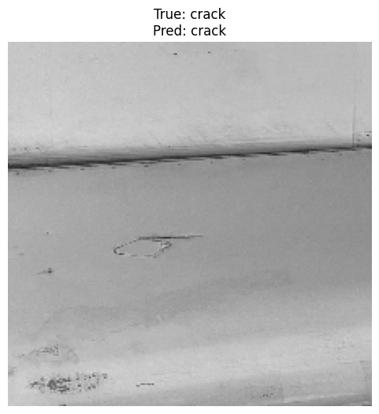

# Course 2: Introduction to Deep Learning & Neural Networks with Keras

This folder contains coursework and projects completed for the *Introduction to Deep Learning & Neural Networks with Keras* course, part of the **IBM AI Engineer Professional Certificate** on Coursera.

---

## 🧠 Course Description  
This course introduces the fundamental concepts and building blocks of deep learning. Using Keras with TensorFlow as the backend, learners explore how to construct, train, and evaluate deep neural networks for various tasks, including image and text classification.

By the end of this course, you will be able to:

- Understand the basic architecture of neural networks, including input, hidden, and output layers, activation functions, weights, and biases.
- Implement and train fully connected (dense) neural networks using Keras.
- Utilize key deep learning concepts such as forward and backward propagation, gradient descent, and loss minimization.
- Apply different activation functions such as ReLU, Sigmoid, and Softmax, and understand their impact on training and performance.
- Build multi-layer neural networks and tune hyperparameters such as learning rate, batch size, number of epochs, and hidden layers.
- Apply deep learning models to real-world problems, such as digit recognition using MNIST and sentiment analysis using word embeddings and LSTM layers.
- Evaluate model performance using loss curves, accuracy metrics, and confusion matrices.
- Improve model generalization using regularization techniques such as dropout, early stopping, and batch normalization.
- Leverage pre-trained embeddings and layers for natural language processing tasks.
- Use Keras' Sequential API to rapidly prototype deep learning models and pipelines.

---

## 📂 Contents: The coding projects I worked on (8 projects)
- Three projects for building more intuïtion for forward propagation, backpropogation, vanishing gradient, and activation functions **(but focus on intuïtion and not applicable directly in real word so left it out)**.
- `concrete_compressive_strength.py`: Building a regression model in Keras involving multiple hidden layers with ReLu and the Adam optimiser, predicting the total compressive strenght based on attributes. Final MSE_validation was 25.89 (90/10 train-val best results).
- `conventionalnn_mnist`: Predicting handrwitten digits in MNIST dataset using a conventional NN (NN). Highest accuracy obtained 0.995 (two hidden layers).
- `convolutionalnn_mnist`: Predicting handrwitten digits in MNIST dataset using a convolutational NN (CNN). Highest accuracy obtained 0.9977 (two sets of convolutional and pooling layers).
- `transformer_seq2seq_translation`: Building a seq-to-seq transormer with self-attention to perform English to Spanish translation (achieved 100% accuracy on a small set of predefined text pairs). 
- `aviation_damage`: Classifying aircraft damage using a pre-trained VGG16 model (16 layers) and the RESNET model which I both fine-tuned (highest val. accuracy 68.8%) . Also generating captions using a pretrained transformer model from BLIP (huggingface).

     
---

## 🔧 Tools and Libraries

- Python  
- Jupyter Notebooks  
- TensorFlow / Keras  
- NumPy  
- Matplotlib / Seaborn  

---

## 📌 Certificate Series  
This is the second course in the **IBM AI Engineer Professional Certificate** on Coursera.
