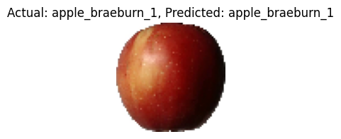
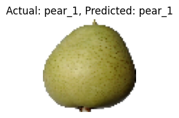
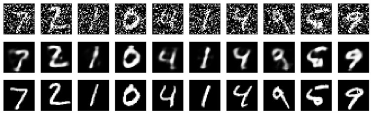
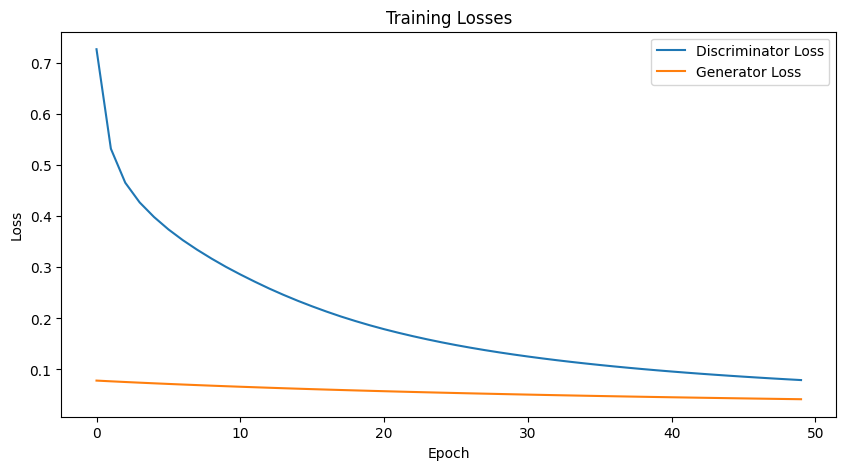
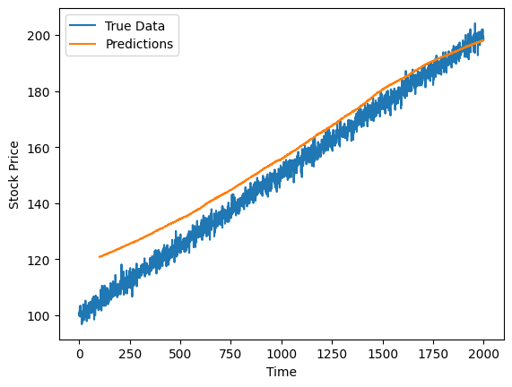

# Deep Learning with Keras & TensorFlow – Project Implementations

This folder contains advanced deep learning implementations developed during the  
**IBM AI Engineering Professional Certificate**.

The focus of this module was advanced model design using TensorFlow/Keras, 
including CNNs, transformers, generative models, reinforcement learning agents, 
and custom training workflows.

---

## 🧠 Overview

Key areas explored:

- Convolutional neural networks & transfer learning
- Transformer architectures for NLP and time-series
- Autoencoders, GANs, and diffusion models
- Custom training loops and hyperparameter tuning
- Reinforcement learning (Q-learning, DQN)
- Advanced data augmentation and preprocessing

These projects extend my deep learning foundation toward applied ML engineering 
and production-oriented experimentation.

---

## 📂 Selected Implementations

### 🔹 Model Architecture & Training

- `functional_api.py` – Functional API experiments with dropout & batch normalization  
- `custom_trainingloop_mnist.py` – Custom training loop with callbacks and logging  
- `mnist_hyperparam_tune.py` – Hyperparameter tuning with Keras Tuner  

---

### 🔹 Computer Vision & Transfer Learning

- `transfer_learning_vgg_16.py` – VGG16 fine-tuning (binary classification, **100% accuracy**)  
- `detecing_fruits` – Fruit classification (**58% → 90.05%**)  
- `trash_sorting` – Waste classification (**84.9% → 92.19%**)  
- `advanced_data_augmentation.py` – Data augmentation pipelines

---

### 🔹 Generative Models & Representation Learning

- `decoding_mnist.py` – Autoencoder-based denoising  
- `diffusion_denoise.py` – Diffusion model reducing loss **0.204 → 0.0996**  
- `gan_generation.py` – GAN-based image generation experiments  
- `transpose_convolution_image_reconstruction.py` – Image reconstruction with transpose convolutions

---

### 🔹 Transformers & Sequence Models

- `building_advanced_ts_transformer.py` – Encoder-only transformer for stock forecasting  
- `shakespeare_transformer.py` – Transformer-based text generation

---

### 🔹 Reinforcement Learning

- `q_learning_agent_cartpole.py` – Q-learning control agent (baseline)  
- `dqn_cartpolev1.py` – Deep Q-Network with replay buffer (**~400% improvement**)

---

## 🔧 Tools & Libraries

Python • TensorFlow • Keras • NumPy • Pandas • Matplotlib

---

## 📌 Context

This module represents the advanced deep learning component of the  
IBM AI Engineering Professional Certificate and complements my work in 
reinforcement learning, LLM systems, and applied ML pipelines.
