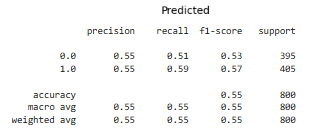
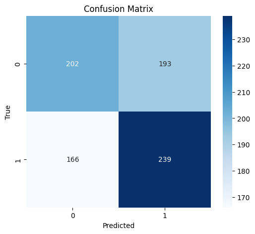

# Course 4: Introduction to Neural Networks and PyTorch

This folder contains coursework and projects completed for the **[Introduction to Neural Networks and PyTorch](https://www.coursera.org/learn/deep-neural-networks-with-pytorch?specialization=ai-engineer)** course, part of the [IBM AI Engineer Professional Certificate](https://www.coursera.org/professional-certificates/ai-engineer) on Coursera.

## 🧠 Course Description

This course provides a practical and theoretical foundation in deep learning using PyTorch. Learners are introduced to fundamental neural network concepts and architectures including feedforward networks, activation functions, loss functions, backpropagation, and optimizers.

By the end of this course, you will be able to:

- Understand and implement key neural network components, such as layers, activation functions (ReLU, Sigmoid, Tanh), and loss functions (MSE, CrossEntropy).
- Build and train deep neural networks using PyTorch, using real-world datasets like MNIST.
- Apply key techniques such as backpropagation and stochastic gradient descent (SGD) for weight updates.
- Utilize PyTorch modules including `torch.nn`, `torch.optim`, `torch.utils.data`, and `torchvision`.
- Perform forward and backward passes manually and with autograd for educational understanding and debugging.
- Evaluate neural network performance using metrics like accuracy, and visualize training curves using Matplotlib.
- Understand and implement techniques to prevent overfitting including dropout and data augmentation.
- Prepare custom datasets using PyTorch `Dataset` and `DataLoader` for flexible and efficient training pipelines.

---

## 📂 Contents: The coding projects I worked on (19 projects):

- Seventeen projects for building fundamental knowledge in pytorch: about 1D tensors, two-dimensinal tensors, derrivatives, loading existing datasets(f.e. MNIST), linear regression (3 labs), SGD, mini-batch SGD, optimisation, training and validating via DataLoader and hyperparameter tuning loops, linear regression with high dimensionality and many outputs (4 labs), logistic regression, cross-entropy **(but focus on intuïtion and learning and not applicable directly in real word so left it out)**. 
- `breast_cancer_classification.py`: Using a variety of neural network configurations to predict whether brain cells are benign or malignant. 
- `league_of_legends_outcome_prediction.py`: Build a logistic regression to predict the outcome of a LOL match based on in-game statistics. Utilising weight_decay(momentum) led to a negligable improvement in test accuracy. 
  

---

## 🔧 Tools and Libraries

- Python
- Jupyter Notebooks
- PyTorch
- Torchvision
- NumPy
- Matplotlib

---

## 📌 Certificate Series

This is the fourth course in the [IBM AI Engineer Professional Certificate](https://www.coursera.org/professional-certificates/ai-engineer).
