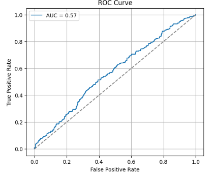

# Introduction to Neural Networks with PyTorch – Project Implementations

This folder contains neural network implementations developed during the  
**IBM AI Engineering Professional Certificate**.

The focus of this module was building a strong PyTorch foundation, covering 
model construction, training workflows, optimization, and dataset handling 
using real-world classification tasks.

---

## 🧠 Overview

Key areas explored:

- Neural network fundamentals using PyTorch
- Optimization and training workflows
- Custom datasets and DataLoader pipelines
- Autograd mechanics and backpropagation
- Regularization and evaluation techniques

Several smaller lab-style experiments were completed to build intuition 
around tensors, gradients, and optimization; only the more applied 
implementations are highlighted below.

---

## 📂 Selected Implementations

### 🔹 Classification Models

- `breast_cancer_classification.py`  
  Neural network architectures for tumor classification.  
  Best test accuracy: **97.5%**.

- `league_of_legends_outcome_prediction.py`  
  Logistic regression model predicting match outcomes from gameplay statistics.  
  Explored weight decay and optimization strategies.

---

## 🔧 Tools & Libraries

Python • PyTorch • Torchvision • NumPy • Matplotlib • Jupyter

---

## 📌 Context

This module establishes the PyTorch foundation within the  
IBM AI Engineering Professional Certificate and supports later work 
in reinforcement learning, transformers, and applied deep learning systems.
