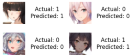
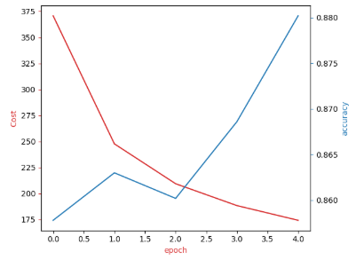

# Course 5: Deep Learning with PyTorch

This folder contains coursework and projects completed for the **[Deep Learning with PyTorch](https://www.coursera.org/learn/advanced-deep-learning-with-pytorch?specialization=ai-engineer)** course, part of the [IBM AI Engineer Professional Certificate](https://www.coursera.org/professional-certificates/ai-engineer) on Coursera.

## 🧠 Course Description

This course builds upon foundational deep learning concepts to explore advanced techniques using PyTorch. Learners dive into modern neural network architectures and methods to solve complex real-world tasks such as image classification, time series forecasting, and natural language processing.

By the end of this course, you will be able to:

- Understand and implement convolutional neural networks (CNNs) for image classification and feature extraction.
- Build and train recurrent neural networks (RNNs), including LSTM and GRU architectures, for sequential data.
- Apply transfer learning with pretrained models like ResNet and use fine-tuning for improved performance.
- Understand and implement common regularization techniques including batch normalization and dropout in deeper networks.
- Use PyTorch’s modular tools (`torch.nn`, `torch.utils.data`, `torchvision`, `torchtext`) to build scalable training pipelines.
- Perform sequence modeling for tasks such as text generation and sentiment analysis.
- Visualize learned features and training metrics to interpret and debug model behavior.

---

## 📂 Contents: The coding projects I worked on (22 projects)

-Sixteen projects including two projects on logistic regression MSE and logistic regression cross entropy, two projects based on softmax classifiers, four projects focused on building (deep) neural networks in pytorch, one on nn.ModuleList(), two on dropout classification/regression, He initialisation with ReLu, convolution, activation function and maxpooling, multiple input and output channels, CNN simple example **(but focus on intuïtion and learning and not applicable directly in real word so left it out)**.
- `different_mnist_initalisations.py`: Comparing Python default, uniform, and Xavier Uniform initialisations on MNIST dataset. From high to low: Xavier(63%), Default (23%), Uniform (12%) when trained over 15 epoch.
- `normalised_batch_mnist.py`: Investigating the effect of utilising batch normalisation led to an 2% increase which is relatively low since the regular version already achieved around 97.5% accuracy on MNIST.
- `cnn_mnist.py`: Implementing a two convolution layer and one connecting layer led to an 95% accuracy on the MNIST dataset.
- `cnn_mnist_batch.py`: Implementing the same CNN as before but now also normalising the ouputs of the activation functions led to an increased accuracy of 98%.
- `cnn_anime.py`: Building a CNN for animé character classification (Japanese data set of 130 classes, 9738 images) we chose the animés Anastasia and takao each with 50 samples. In addition we utilised leaky_relu (1), looked at the effect of additional epochs(2), 
 and also used different character classes for training and evaluation like arcueid_brunestud and yukinoshita_yukino(3). On the original animés and different classes this achieved 100% accuracy.

- `cnn_fashion_mnist.py`: Utiilsed a CNN to classify fashion items in the Fashion-MNIST ddataset.

---

## 🔧 Tools and Libraries

- Python
- Jupyter Notebooks
- PyTorch
- Torchvision / Torchtext
- NumPy
- Matplotlib

---

## 📌 Certificate Series

This is the fifth course in the [IBM AI Engineer Professional Certificate](https://www.coursera.org/professional-certificates/ai-engineer).
