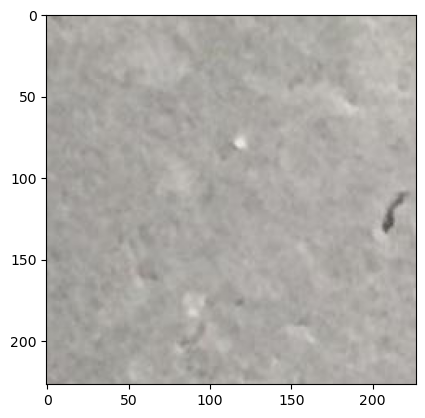

# AI Capstone Project with Deep Learning – Project Implementations

This folder contains the capstone project developed during the  
**IBM AI Engineering Professional Certificate**.

The objective of this module was to design and implement an end-to-end deep learning workflow — 
from data preparation and transfer learning to model evaluation and result interpretation.

---

## 🧠 Overview

Key areas explored:

- End-to-end deep learning pipeline design
- Transfer learning using pretrained CNN architectures
- Data preprocessing and augmentation workflows
- Performance evaluation and visual analysis

Smaller lab-style exercises related to data loading and preprocessing are included, 
while the main applied project is highlighted below.

---

## 📂 Project

### 🔹 Concrete Crack Detection – ResNet50

- `concrete_resnet50.py`  
  Fine-tuned a **ResNet50** model to detect structural cracks in concrete surfaces 
  that are difficult to identify visually.

  Focus areas:
  - Transfer learning and fine-tuning
  - Image preprocessing pipelines
  - Model evaluation for real-world computer vision tasks

---

## 🔧 Tools & Libraries

Python • PyTorch / Keras • Torchvision • NumPy • Pandas • Matplotlib

---

## 📌 Context

This capstone consolidates earlier deep learning work from the certificate, 
bridging CNN experimentation with more applied computer vision workflows and 
production-oriented modeling practices.
