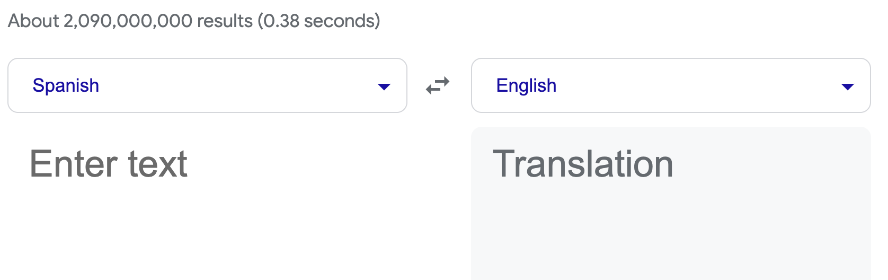

# Generative AI & LLMs: Architecture and Data Preparation – Project Implementations

This folder contains generative AI and LLM-related implementations developed during the  
**IBM AI Engineering Professional Certificate**.

The focus of this module was understanding transformer architectures, tokenization workflows, 
and NLP data preparation pipelines used in modern large language model systems.

---

## 🧠 Overview

Key areas explored:

- Transformer-based language models and generative AI architectures
- Tokenization strategies and text preprocessing
- NLP data loaders and batching pipelines
- Experimentation with pretrained Hugging Face models

These projects establish the foundation for later work in LLM fine-tuning, alignment, and RAG systems.

---

## 📂 Selected Implementations

### 🔹 Hugging Face Model Experiments

- `hugging_models_chatbot.py`  
  Built chatbot experiments using multiple pretrained models:

  - facebook/blenderbot-400M-distill  
  - flan-t5-base  
  - google/flan-t5-small  
  - facebook/bart-base  

Explored differences in generation quality and response behavior.

---

### 🔹 Tokenization & NLP Pipelines

- `implementing_tokenization.py`  
  Implemented multiple tokenization strategies using:

  - NLTK  
  - spaCy  
  - BERT tokenizers  
  - XLNetTokenizer  
  - torchtext pipelines

---

### 🔹 NLP Data Loader

- `data_loader_translation.py`  
  Translation pipeline using a custom NLP DataLoader on the Multi30k dataset  
  (Spanish ↔ English).

---

## 🔧 Tools & Libraries

Python • PyTorch • Hugging Face Transformers • NLTK • spaCy • NumPy • Matplotlib

---

## 📌 Context

This module introduces the LLM engineering foundation within the  
IBM AI Engineering Professional Certificate and supports later work 
in transformer fine-tuning, alignment techniques, and retrieval-augmented generation systems.
