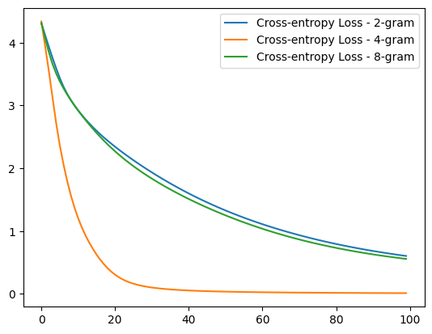
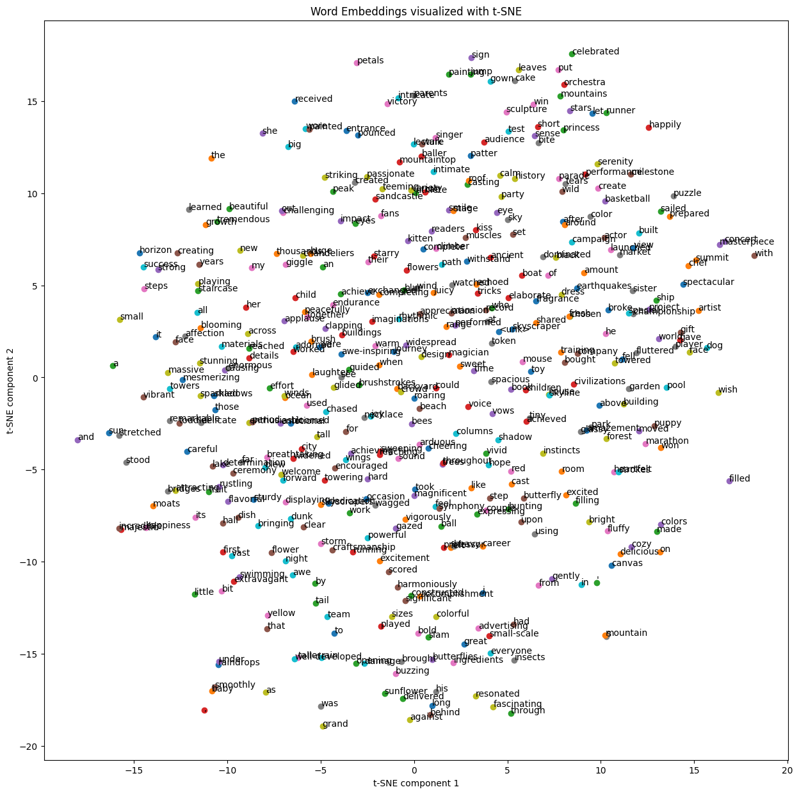

# Course 8: Gen AI Foundational Models for NLP & Language Understanding

This folder contains coursework and projects completed for the **[Gen AI Foundational Models for NLP & Language Understanding](https://www.coursera.org/learn/gen-ai-foundational-models-for-nlp-and-language-understanding?specialization=ai-engineer)** course, part of the [IBM AI Engineer Professional Certificate](https://www.coursera.org/professional-certificates/ai-engineer) on Coursera.

## 🧠 Course Description

This course provides a comprehensive introduction to foundational models in natural language processing (NLP) and language understanding. Learners explore various techniques for text representation and model architectures used in NLP tasks.

By the end of this course, you will be able to:

- Explain how to use one-hot encoding, bag-of-words, embedding, and embedding bags to convert words to features.
- Build and use Word2Vec models for contextual embedding.
- Build and train a simple language model with a neural network.
- Utilize N-gram and sequence-to-sequence models for document classification, text analysis, and sequence transformation.

---

## 📂 Contents: The coding projects I worked on (5 projects)

- `classifying_document.py`: Building a large-scale document classifier with EmbeddingBag layer and softmax output layer, trained on the AG_NEWS dataset with a data loader, visualised using 3D t-SNE. Final test accuracy was 84% over 4 distinct classes.
- `n_gram_analysis_models.py`: Building an N-gram Histogram model in NTLK to uncover word patterns in 90s rap. Utilised monogram, bigram, and trigram analysis of which the latter performs best, but limited compared to more advanced models as we will see next.
- `FNN_LanguageModel.py`: Building a gneral feed forward neural network (FNN) to predict rap words, which works significantly better than previous approach. Compared 2-gram, 4-gram, and 8-gram in terms of their perplexity over training epoch, see below for results.  
  
- `Word2VecModels.py`: Build several Word2Vec models including CBOW and Skip-gram based on a toy rap dataset, in addition implemented the Standford Glove model. Visulaised the resulting embeddings via t-SNE 2D embeddings. Over 400 epoch CBOW significantly outperformed Skip-gram with a nearly zero cross-entropy versus around 3. This can be explained by the limited occurence of rare words.  
  
- `Word2VecApplications.py`: Implemented Stanfords GloVe model and trained a word2vec using the gensim library. Finally, used the optimised embeddings to predict the category of AG_NEWS articles, which led to 64.6% accuracy over 10 epoch.

---

## 🔧 Tools and Libraries

- Python
- Jupyter Notebooks
- PyTorch
- NumPy
- Matplotlib

---

## 📌 Certificate Series

This is the eighth course in the [IBM AI Engineer Professional Certificate](https://www.coursera.org/professional-certificates/ai-engineer).
