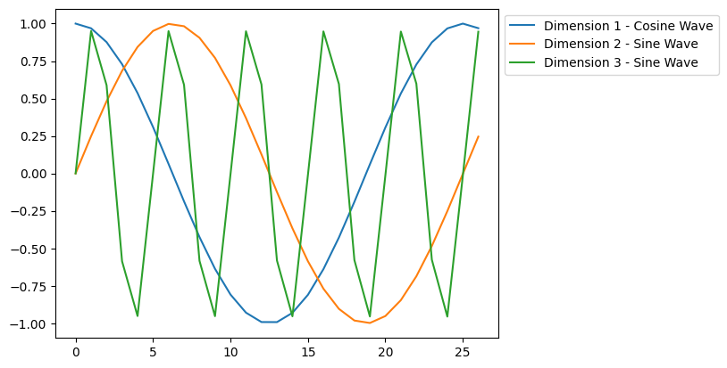
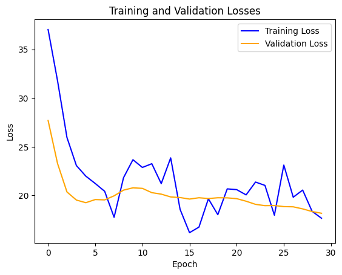
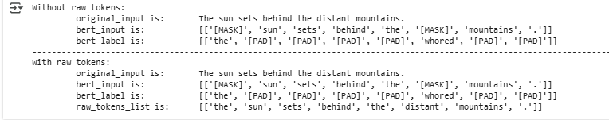

# Course 9: Generative AI Language Modeling with Transformers

This folder contains coursework and projects completed for the **[Generative AI Language Modeling with Transformers](https://www.coursera.org/learn/generative-ai-language-modeling-with-transformers?specialization=ai-engineer)** course, part of the [IBM AI Engineer Professional Certificate](https://www.coursera.org/professional-certificates/ai-engineer) on Coursera.

## 🧠 Course Description

This course provides an in-depth overview of transformer-based models for natural language processing (NLP). Learners explore both encoder and decoder architectures, focusing on their applications in tasks like text classification and language translation.

By the end of this course, you will be able to:

- Explain attention mechanisms in transformers and their role in capturing contextual information.
- Describe language modeling using decoder-based models like GPT and encoder-based models like BERT.
- Implement positional encoding, masking, and attention mechanisms in PyTorch.
- Utilize transformer-based models for text classification and language translation tasks.

---

## 📂 Contents: The coding projects I worked on

- `attention_pos_encoding_models.py`: Experimented with attention mechanism for translation models and more general setups involing multi-head attention. Also experimented with several postitional encoding layers, and with Transformer Encoder and Decoder models, building a broad intuïtion around it.  
  
- `archive_classifier.py`: Rigorously build a custom transformer model to spit through large archives of documents and classify the documents under five distinct categories, scoring over 80% accuracy. The model consists of an embedding layer, positional encoding layer (tried several to see which worked best), and two sequential transformer encoders followed by linear layer.
- `gpt_text_generator.py`: Fully build and trained a custom small-scale GPT model (due to limited comput. resources) to generate text based on user input, and saw from experimentation that it performed similar to the GPT2 from HuggingFace on a variety of tasks which was trained on a massive dataset with enormous computational resources.  
  
- `baby_bert.py`: Build and trained a `baby` BERT model for Next Sentence Prediction (NSP) and Masked Language Modelling (MLM) for conceptual understanding. The model did not perform that well mostly due to the relatively small number of parameters and data on which it was trained, it was apparent however that the model had language understanding (for example see image). 
- `bert_data_fetching.py`: Build a series of functions dedicated to turn plain text into BERT input data, as was used for example for the previous project, and can be used for very large datasets too.  
  

---

## 🔧 Tools and Libraries

- Python
- Jupyter Notebooks
- PyTorch
- Hugging Face Transformers
- NumPy
- Matplotlib

---

## 📌 Certificate Series

This is the ninth course in the [IBM AI Engineer Professional Certificate](https://www.coursera.org/professional-certificates/ai-engineer).
