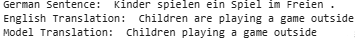

# Generative AI Language Modeling with Transformers – Project Implementations

This folder contains transformer-based language modeling implementations developed during the  
**IBM AI Engineering Professional Certificate**.

The focus of this module was building and experimenting with encoder and decoder transformer 
architectures, including custom GPT-style models, BERT-style models, and translation systems.

---

## 🧠 Overview

Key areas explored:

- Attention mechanisms and positional encoding
- Transformer encoder and decoder architectures
- Custom GPT-style language modeling
- BERT-style masked language modeling and NSP
- Sequence-to-sequence translation pipelines

These projects extend foundational NLP work toward practical transformer engineering 
and generative AI systems.

---

## 📂 Selected Implementations

### 🔹 Attention & Transformer Architecture

- `attention_pos_encoding_models.py`  
  Implemented multi-head attention, positional encoding strategies, and 
  transformer encoder/decoder experimentation.

---

### 🔹 Transformer-Based Classification

- `archive_classifier.py`  
  Custom transformer model for document classification across five categories.  
  Architecture: embeddings → positional encoding → stacked transformer encoders → linear head.  
  Achieved **80%+ accuracy**.

---

### 🔹 Custom GPT Language Model

- `gpt_text_generator.py`  
  Built and trained a lightweight GPT-style model due to limited compute resources.  
  Generated text with performance comparable to small Hugging Face GPT-2 baselines on controlled tasks.

---

### 🔹 BERT-Style Modeling

- `baby_bert.py`  
  Custom BERT implementation for Masked Language Modeling (MLM) and Next Sentence Prediction (NSP).

- `bert_data_fetching.py`  
  Data preprocessing utilities for converting raw text into BERT-ready inputs.

---

### 🔹 Transformer Translation

- `transformer_translate_model.py`  
  Encoder–decoder transformer translating German → English documents.  
  Achieved BLEU scores close to **1.0** on several samples.

---

## 🔧 Tools & Libraries

Python • PyTorch • Hugging Face Transformers • NumPy • Matplotlib

---

## 📌 Context

This module represents the transformer engineering component of the  
IBM AI Engineering Professional Certificate and supports later work in 
LLM alignment, RAG systems, and production-oriented generative AI pipelines.
