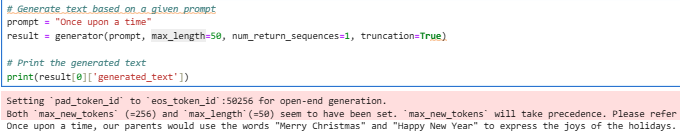
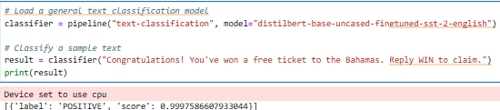

# Course 10: Generative AI Engineering and Fine-Tuning Transformers

This folder contains coursework and projects completed for the **[Generative AI Engineering and Fine-Tuning Transformers](https://www.coursera.org/learn/generative-ai-engineering-and-fine-tuning-transformers?specialization=ai-engineer)** course, part of the [IBM AI Engineer Professional Certificate](https://www.coursera.org/professional-certificates/ai-engineer) on Coursera.

## 🧠 Course Description

This course focuses on the practical aspects of fine-tuning transformer-based large language models (LLMs) for generative AI applications. Learners gain hands-on experience with frameworks like Hugging Face and PyTorch to optimize and adapt pre-trained models efficiently.

By the end of this course, you will be able to:

- Perform parameter-efficient fine-tuning (PEFT) using techniques such as Low-Rank Adaptation (LoRA) and Quantized LoRA (QLoRA).
- Utilize pre-trained transformers for language tasks and fine-tune them for specific applications.
- Load models and perform inference using Hugging Face and PyTorch.
- Understand and apply model quantization techniques to optimize performance.

---

## 📂 Contents: The coding projects I worked on
- `hugging_face_models.py`: Loaded and utilised several hugging face models to manually and also via the pipeline function to perform sentiment classification (DistilBERT) and text generation (GPT-2).
-  
   
- `llm_pretraining_huggingface.py`: Utilised several pre-trained LLMs (facebook/opt-350m, bert-scratch-model.pt, bert-base-uncased)  and self-supervised fine-tuned them on several of my data sets of my own choice manually (like wiki). Model showed a very distinct performance based on the perplexity measure.
---

## 🔧 Tools and Libraries

- Python
- Jupyter Notebooks
- PyTorch
- Hugging Face Transformers
- NumPy
- Matplotlib

---

## 📌 Certificate Series

This is the tenth course in the [IBM AI Engineer Professional Certificate](https://www.coursera.org/professional-certificates/ai-engineer).
