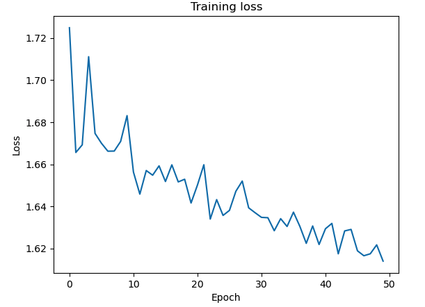

# Generative AI Engineering & Fine-Tuning Transformers – Project Implementations

This folder contains transformer fine-tuning and generative AI engineering experiments developed during the  
**IBM AI Engineering Professional Certificate**.

The focus of this module was parameter-efficient fine-tuning (PEFT), LoRA/QLoRA workflows, 
and practical adaptation of pretrained LLMs using PyTorch and Hugging Face.

---

## 🧠 Overview

Key areas explored:

- Parameter-efficient fine-tuning (LoRA, adapters)
- Transformer inference and deployment workflows
- Model quantization and optimization
- Comparative fine-tuning strategies across datasets
- Practical experimentation with pretrained LLMs

These projects extend earlier transformer work toward applied LLM engineering and production-oriented workflows.

---

## 📂 Selected Implementations

### 🔹 Hugging Face Model Experiments

- `hugging_face_models.py`  
  Experimented with pretrained models for sentiment classification and text generation:

  - DistilBERT (sentiment analysis)
  - GPT-2 (text generation)

---

### 🔹 LLM Pretraining & Fine-Tuning

- `llm_pretraining_huggingface.py`  
  Fine-tuned multiple pretrained LLMs (facebook/opt-350m, bert-base-uncased, custom BERT)  
  using self-supervised learning and evaluated performance via perplexity.

- `stateofart_pretrained_llm_finetuning.py`  
  Compared manual BERT fine-tuning vs Hugging Face SFTTrainer workflows.  
  Demonstrated trade-offs between control and implementation efficiency.

---

### 🔹 Parameter-Efficient Fine-Tuning

- `adapters_classificaton_model.py`  
  Compared full fine-tuning, last-layer training, and adapter-based approaches:

  - Full model: 89% accuracy (~2–3 hours)
  - Last layer: 65% accuracy (~minutes)
  - Adapter model: 87% accuracy (~12 minutes)

- `lora_sentiment_analysis.py`  
  Applied LoRA fine-tuning on AG News → IMDB sentiment task.  
  Achieved **92% accuracy**.

---

## 🔧 Tools & Libraries

Python • PyTorch • Hugging Face Transformers • NumPy • Matplotlib

---

## 📌 Context

This module represents the applied LLM fine-tuning component of the  
IBM AI Engineering Professional Certificate and builds directly on earlier 
transformer architecture work, leading into RLHF and RAG-based systems.
