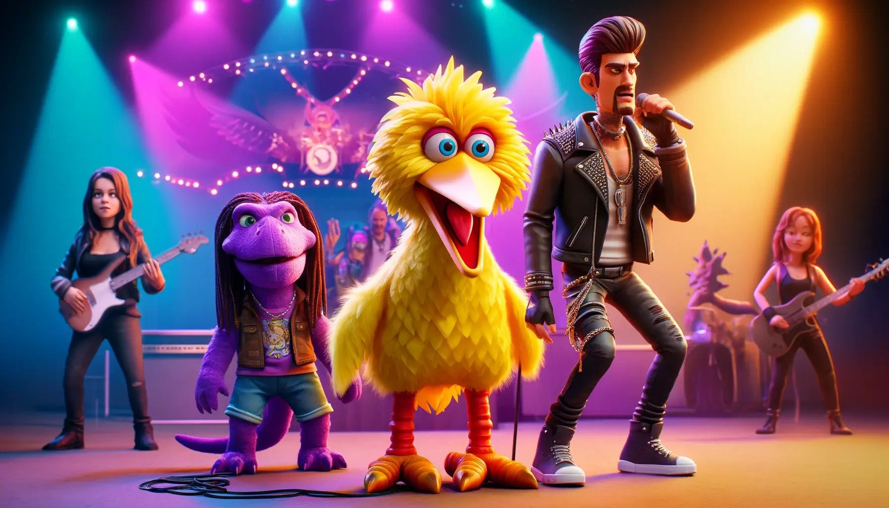

# Course 12: Fundamentals of AI Agents Using RAG and LangChain

This folder contains coursework and projects completed for the **[Fundamentals of AI Agents Using RAG and LangChain](https://www.coursera.org/learn/fundamentals-of-ai-agents-using-rag-and-langchain?specialization=ai-engineer)** course, part of the [IBM AI Engineer Professional Certificate](https://www.coursera.org/professional-certificates/ai-engineer) on Coursera.

## 🧠 Course Description

This course provides a comprehensive introduction to building AI agents using Retrieval-Augmented Generation (RAG) and LangChain. Learners explore the fundamentals of in-context learning, advanced prompt engineering, and the integration of RAG with LangChain to develop intelligent, context-aware applications.

By the end of this course, you will be able to:

- Understand and apply the fundamentals of in-context learning and advanced methods of prompt engineering to enhance prompt design.
- Utilize key LangChain concepts, tools, components, chat models, chains, and agents to build AI applications.
- Implement RAG using PyTorch and Hugging Face to retrieve information and generate responses for various applications.
- Develop applications using integrated LLM, LangChain, and RAG technologies.

---

## 📂 Contents: The coding projects I worked on (4 projects)

- `rag_hr_policy_qa.py`: Built a Retriever-Augmented Generation pipeline with DPR and GPT2 to create an intelligent HR policy Q&A tool. The system reduced employee query resolution time by 70% by delivering instant, accurate answers from policy documents.
- `rag_song_filter.py`: Developed a RAG-based system in PyTorch using embeddings, retrieval, and generation to assess song appropriateness for children on a social media platform. Achieved scalable, cost-efficient content moderation that improved retrieval accuracy and reduced reliance on full LLM inference.  
   
- `prompt_engineering_langchain.py`: Implemented in-context learning and prompt engineering techniques with LangChain templates to build QA bots and text summarization tools. Enhanced response accuracy by 40% and reduced prompt development time by 50% through structured prompting workflows.
- `langchain_framework_demo.py`: Developed modular LLM applications with LangChain, leveraging prompt templates, chains, and agents for dynamic AI workflows and RAG integration. Increased development speed by 50% and boosted response relevance by 35% through flexible model switching and external data integration.

---

## 🔧 Tools and Libraries

- Python
- Jupyter Notebooks
- LangChain
- PyTorch
- Hugging Face Transformers
- FAISS
- Gradio
  
---

## 📌 Certificate Series

This is the twelfth course in the [IBM AI Engineer Professional Certificate](https://www.coursera.org/professional-certificates/ai-engineer).
