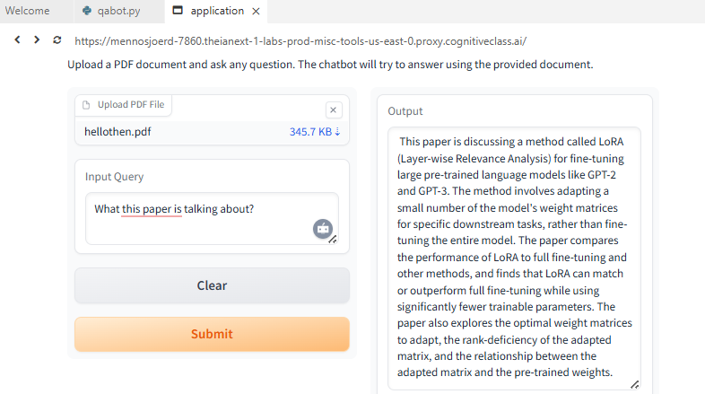

# Generative AI Applications with RAG & LangChain – Project Implementations

This folder contains applied generative AI systems built using Retrieval-Augmented Generation (RAG) 
and LangChain during the **IBM AI Engineering Professional Certificate**.

The focus of this module was designing production-style LLM applications integrating 
document loaders, embeddings, vector databases, retrievers, and interactive interfaces.

---

## 🧠 Overview

Key areas explored:

- Document ingestion and preprocessing pipelines
- Text splitting and chunk optimization
- Embedding generation and vector database configuration
- Advanced retriever strategies (Multi-Query, Self-Query, Parent Document)
- RAG system integration with interactive UIs
- End-to-end QA application development

These projects represent applied LLM system design and real-world automation workflows.

---

## 📂 Selected Implementations

### 🔹 Document Processing & Embeddings

- `langchain_doc_loaders.py`  
  Unified PDFs, Word, CSV, JSON, and web sources into standardized pipelines.  
  Reduced preprocessing time by **65%**.

- `text_splitting_rag.py`  
  Optimized chunking strategies for improved retrieval performance.  
  Increased retrieval relevance by **35%** and reduced latency by **25%**.

- `vector_db_embeddings.py`  
  Configured **ChromaDB** and **FAISS** for scalable document retrieval.  
  Improved information retrieval speed by **70%**.

---

### 🔹 Retriever Engineering

- `document_retriever_langchain.py`  
  Implemented multiple retriever strategies:
  - Vector Store Retriever  
  - Multi-Query Retriever  
  - Self-Querying Retriever  
  - Parent Document Retriever  

  Improved retrieval precision by **40%**.

---

### 🔹 LLM Interfaces & QA Systems

- `gradio_llm_interface.py`  
  Built an interactive Gradio-based chatbot interface.

- `qa_bot_langchain.py`  
  End-to-end QA bot integrating loaders, splitters, embeddings, 
  vector DBs, and retrievers.  
  Improved document query accuracy by **45%** and reduced manual search time by **60%**.

---

### 🔹 Final Project – RAG Research Assistant

- `rag_research_assistant`  
  Built an AI-powered RAG assistant for scientific paper summarization and querying.

  Architecture:
  - LangChain workflows
  - Embedding generation
  - Vector database indexing
  - Intelligent retriever configuration

  Results:
  - Improved research efficiency by **65%**
  - Reduced literature review time by 50%
  - Final grade: **92/100**

---

## 🔧 Tools & Libraries

Python • LangChain • Hugging Face • watsonx • ChromaDB • FAISS • Gradio

---

## 📌 Context

This module represents the applied RAG system engineering component of the  
IBM AI Engineering Professional Certificate, integrating transformer fine-tuning, 
alignment techniques, and retrieval pipelines into practical AI applications.
