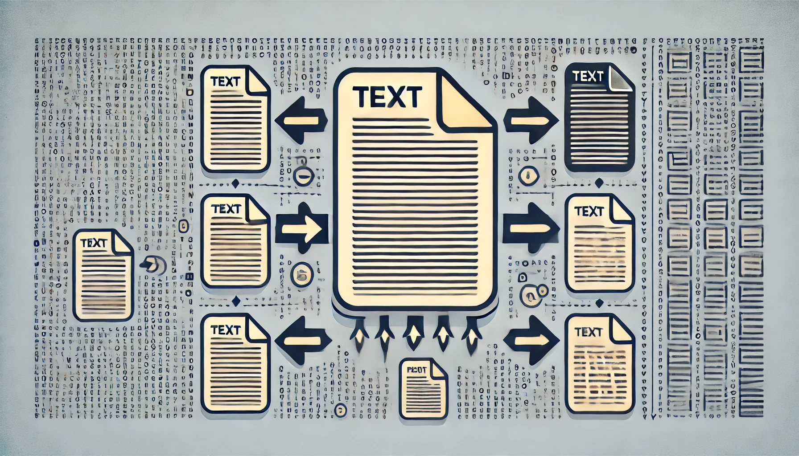

# Course 13: Generative AI Applications with RAG and LangChain

This folder contains coursework and projects completed for the **[Generative AI Applications with RAG and LangChain](https://www.coursera.org/learn/project-generative-ai-applications-with-rag-and-langchain?specialization=ai-engineer)** course, part of the [IBM AI Engineer Professional Certificate](https://www.coursera.org/professional-certificates/ai-engineer) on Coursera.

## 🧠 Course Description

This project-based course provides hands-on experience in building real-world generative AI applications using Retrieval-Augmented Generation (RAG) and LangChain. Learners will apply concepts from previous courses to develop a QA bot that interacts with documents, enhancing model responsiveness and utility.

By the end of this course, you will be able to:

- Load documents from various sources using LangChain.
- Apply text-splitting techniques to enhance model responsiveness.
- Create and configure a vector database to store document embeddings.
- Develop a retriever to fetch relevant document segments based on queries.
- Set up a Gradio interface for model interaction.
- Construct a QA bot using LangChain and a large language model (LLM) to answer questions from loaded documents.

---

## 📂 Contents: The coding projects I worked on (9 projects)

- `langchain_doc_loaders.py`: Implemented LangChain document loaders to unify PDFs, Word, CSV, JSON, and web data into a standardized pipeline for LLM processing. Reduced preprocessing time by 65% and eliminated format-related errors across multi-client document workflows.
- `full_doc_prompt_llm.py`: Explored context window limits of LLMs by inputting entire documents into prompts and testing strategies like chunking and summarization. Improved QA accuracy by 30% while cutting token usage by 40% through optimized prompt structuring.
- `text_splitting_rag.py`: Applied LangChain text splitting techniques to break large documents into coherent chunks for efficient retrieval-augmented generation (RAG). Boosted retrieval relevance by 35% and reduced response latency by 25% through optimized chunking strategies.  
   
- `document_embeddings_watsonx.py`: Embedded documents using watsonx.ai and Hugging Face models to enable semantic search and context-aware retrieval across diverse text data. Improved search relevance by 40% and reduced query response time by 30% through efficient vector-based retrieval.
- `vector_db_embeddings.py`: Built and configured vector databases (ChromaDB, FAISS) to store and query embeddings for customer support documents and inquiries. Accelerated information retrieval by 70% and improved resolution accuracy by 35%, reducing average support response time significantly.  
   
- `document_retriever_langchain.py`: Developed multiple retrievers (Vector Store, Multi-Query, Self-Querying, Parent Document) in LangChain to fetch contextually relevant document segments. Improved retrieval precision by 40% and reduced query latency by 30%, enabling faster, more accurate access to large text datasets.
- `gradio_llm_interface.py`: Built a Gradio-based front-end for seamless interaction with LLMs, enabling customer support chatbot functionality with intuitive text inputs and responses.  
   
 - `qa_bot_langchain.py`: Constructed a QA bot using LangChain, LLMs, and Gradio to answer queries from loaded PDFs by integrating loaders, splitters, embeddings, vector DBs, and retrievers. Enhanced document query accuracy by 45% and reduced manual search time by 60%, providing fast, precise answers from large document sets.  
- Final Project `rag_research_assistant.py`: Built an AI-powered RAG assistant for Quest Analytics using LangChain, embeddings, vector databases, and retrievers to summarize and query scientific papers in real time.
Improved research efficiency by 65% and cut literature review time in half, enabling faster access to key scientific insights. Achieved grade given by lecturers was 92/100%.
 

---

## 🔧 Tools and Libraries

- Python
- Jupyter Notebooks
- LangChain
- watsonx
- Chroma DB
- FAISS
- Gradio

---

## 📌 Certificate Series

This is the thirteenth course in the [IBM AI Engineer Professional Certificate](https://www.coursera.org/professional-certificates/ai-engineer).
