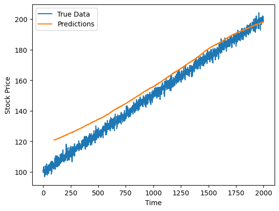
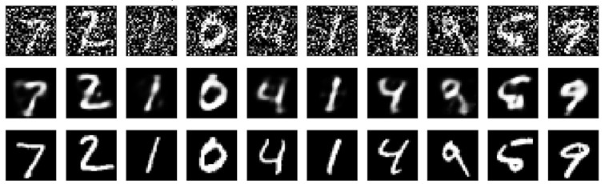

# Course 3: Deep Learning with Keras and TensorFlow

This folder contains coursework and projects completed for the **Deep Learning with Keras and TensorFlow** course, part of the **IBM AI Engineer Professional Certificate** on Coursera.

## 🧠 Course Description

This course provides an in-depth introduction to deep learning using TensorFlow and Keras. You will build, train, and evaluate deep learning models for various tasks, including image classification, time series forecasting, and natural language processing. The course emphasizes practical, hands-on experience using real-world datasets and models.

By the end of this course, you will be able to:

- Understand key concepts behind neural networks, including perceptrons, activation functions, backpropagation, and optimization.
- Use TensorFlow and Keras to build and train deep learning models for both classification and regression problems.
- Develop Convolutional Neural Networks (CNNs) for image data, with advanced techniques like data augmentation, transfer learning, and pretrained models (e.g., VGG, ResNet).
- Build Recurrent Neural Networks (RNNs), Long Short-Term Memory (LSTM) networks, and Gated Recurrent Units (GRUs) for sequential and time-series data.
- Apply embedding layers and pretrained word embeddings for text classification tasks such as sentiment analysis.
- Utilize techniques like dropout, early stopping, batch normalization, and learning rate scheduling to optimize model training and performance.
- Implement models using the Sequential, Functional, and Model Subclassing APIs in Keras.
- Developing several GANs.
- Developing diffusion models.
- Implementing Q-learning and Deep Q-Network to solve reinforcement problems.
- (Prepare models for deployment by saving/loading, exporting, and understanding TensorFlow SavedModel format.)

## 📂 Contents

The coding projects I worked on:

- `functional_api.py`: Applying the functional API to create NNs with different architectures involving dropout and batchnormalisation to decrease overfitting and stabilise training on a randomly generated continious dataset. Best result 54.0% test accuracy.
- `custom_layers.py`: Creating several custom layer architectures involving dropout to cluster randomly generated cluster data from 10 classes. Achieved 11.3% accuracy on test data (relatively good as data quite scattered).
- `advanced_data_augmentation.py`: Applying data augmentation techniques using the ImageDataGenerator, such as rotation, width and height shift, shear, zoom, horizontal flip. Also applying feature-wise and sample-wise normalisation.
   Finally, implementing a custom preprocessing function to add noise to images.
- `transfer_learning_vgg_16.py`: Finetuning the VGG16 to predict the color 'black' or 'white' of the picture (binary_corssentropy). Achieved 100% accuracy.
- `transpose_convolution_image_reconstruction.py`: Creating, training and evaluating different ranspose convolution layer architectures to reconstruct images. Lowest MSE on synthetic data (0.0018) was obtained under relatively small kernel sizes (but more computationally expensive)
- `building_advanced_ts_transformer.py`: Building an advanced encoder-only transformer model for stock prices time series prediction. Defined the individual parts of the transformer by custom layers. Predictions versus actual: 
  
- `shakespeare_transformer.py`: Building, training and evaluting a transformer model for generating Shakespearian sonnets. Led to realistic variations of the original work from Shakespeare.
- `decoding_mnist.py`: Building and training an autoencoder model to denoise MNIST data set images, finetuning it to improve its performance. 
  
- `diffusion_denoise.py`: Using various diffusion model architectures to denoise the MNIST data set. Decreased the validation loss (cross-entropy) from 0.204 (previous decoding_mnist.py) to 0.0996 with the best performing diffusion model.
- ` `:
- ` `:
- ` `:
- ` `:

## 🔧 Tools and Libraries

- Python  
- Jupyter Notebooks  
- TensorFlow  
- Keras  
- NumPy, Pandas  
- Matplotlib, Seaborn  

## 📌 Certificate Series

This is the **third course** in the [IBM AI Engineer Professional Certificate](https://www.coursera.org/professional-certificates/ai-engineer).
---

